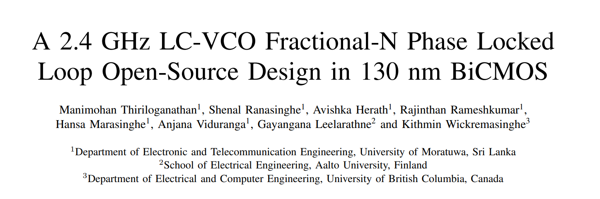
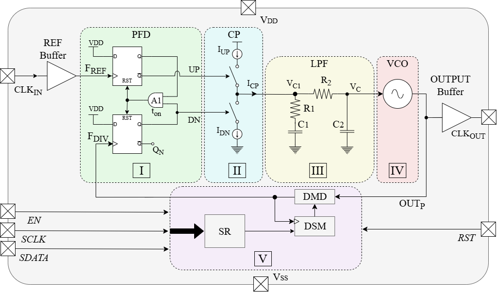

# A 2.4 GHz LC-VCO Fractional-N Phase Locked Loop Open-Source Design in 130nm BiCMOS

## Introduction

This work represents the **first RF integrated circuit design paper from the Department of Electronic and Telecommunication Engineering (ENTC), University of Moratuwa, Sri Lanka**, highlighting the department's growing strength in open-source semiconductor design and advanced wireless communication systems.

Radio frequency (RF) integrated circuit design using open-source tools has traditionally been limited by the absence of reliable passive device models, particularly for on-chip spiral inductors. Consequently, prior open-source RF designs rely on ring-oscillator-based voltage-controlled oscillators (VCOs) with degraded phase noise performance, limiting their applicability in demanding wireless communication standards. This research addresses these challenges by developing a complete, fully open-source 2.4 GHz fractional-N PLL design in the IHP SG13G2 130nm BiCMOS technology, demonstrating that high-performance RF circuits can be achieved entirely within the open-source CMOS design ecosystem.

## Paper Acceptance

<p align="center">
    <br>
    <em><strong>Figure 1:</strong> "A 2.4 GHz LC-VCO Fractional-N Phase Locked Loop Open-Source Design in 130nm BiCMOS" accepted at SMACD 2026</em>
</p>

## Authors

**Manimohan Thiriloganathan, Shenal Ranasinghe, Avishka Herath, Rajinthan Rameshkumar, Hansa Marasinghe, Anjana Viduranga**

Supervised by **Kithmin Wickremasinghe** (MASc) and Co-supervised by **Gayangana Leelarathne**

Department of Electronic and Telecommunication Engineering, University of Moratuwa, Sri Lanka

<p align="center">
    <br>
</p>

## Conference Information

This fractional-N PLL design has been accepted for publication at **SMACD 2026** (International Conference on Synthesis, Modeling, Analysis and Simulation Methods, and Applications to Circuit Design), Dresden, Germany.

# Block Diagram

<p align="center">
    <br>
    <em>Figure 2: Block Diagram of the 2.4 GHz Fractional-N PLL</em>
</p>

# Abstract

Radio frequency (RF) integrated circuit design using the open-source complementary Metal-Oxide semiconductor (CMOS) ecosystem, such as for phase-locked loops (PLLs), is limited by the absence of reliable passive device models, particularly on-chip spiral inductors. Consequently, prior work relies on ring-oscillator-based voltage-controlled oscillators (VCOs) with degraded phase noise performance. This work presents a 2.4 GHz type-II fractional-N PLL implemented in the IHP SG13G2 130nm BiCMOS open-source technology. The proposed design employs a cross-coupled differential LC-VCO integrated with a custom-designed spiral inductor, developed using an open-source electromagnetic modelling workflow in OpenEMS. The optimized inductor achieves 4 nH inductance with a quality factor of 16.8 at 2.45 GHz. The LC-VCO sensitivity is approximately 120 MHz/V while the PLL phase noise is -100.8 dBc/Hz at 1 MHz offset. The complete PLL is realized using a fully open-source electronic design automation (EDA) flow, occupying a total area of 660 μm × 526.5 μm (≈ 0.347 mm²) and consuming 12.73 mW, demonstrating the feasibility of RF integrated circuit design in an open-source CMOS IC design ecosystem.

# Key Features

* **Type-II Charge-Pump Based Fractional-N Architecture** with Delta-Sigma Modulation (DSM) for flexible frequency division.
* **Cross-Coupled Differential LC-VCO** with custom-designed spiral inductor optimized via open-source electromagnetic simulation (OpenEMS).
* **Optimized On-Chip Spiral Inductor**: 4 nH inductance with Q-factor of 16.8 at 2.45 GHz in IHP SG13G2 technology.
* **Output Frequency Range**: 2.35 – 2.55 GHz with center frequency at 2.45 GHz for Wi-Fi/Bluetooth applications.
* **Phase Noise Performance**: -100.8 dBc/Hz at 1 MHz offset with -85 dBc/Hz at 100 kHz offset.
* **Low Power Consumption**: 12.73 mW typical operation with configurable lock time (~25-40 μs).
* **Comprehensive PLL Blocks**: Phase-Frequency Detector (PFD), Charge Pump (CP), Loop Filter, Bias Generator, Bandgap Reference, and Frequency Divider.
* **Fully Open-Source Design**: Implemented using Xschem, Ngspice, OpenEMS, and OpenROAD Flow for complete reproducibility.
* **Compact Layout**: 660 μm × 526.5 μm (≈ 0.347 mm²) in IHP SG13G2 130nm BiCMOS technology.
* **Process Robustness**: Monte Carlo yield >99% across typical, fast, and slow process corners with comprehensive PVT coverage.

# Performance Characteristics

**Table 1:** Summary of the 2.4 GHz Fractional-N PLL characteristics.

| Parameter | Min | Typ | Max | Unit |
|-----------|-----|-----|-----|------|
| Supply Voltage | 1.7 | 1.8 | 1.9 | V |
| Reference Frequency | — | 10 | — | MHz |
| Output Frequency | 2.35 | 2.45 | 2.55 | GHz |
| Loop Bandwidth | 80 | 150 | 300 | kHz |
| Phase Margin | 50 | 55 | 60 | ° |
| VCO Tuning Range | 8 | 9 | 10 | % |
| VCO Sensitivity (K_VCO) | 50 | 120 | 150 | MHz/V |
| Phase Noise @ 100 kHz Offset | — | -85 | — | dBc/Hz |
| Phase Noise @ 1 MHz Offset | — | -100.8 | — | dBc/Hz |
| Charge Pump Current Range | 50 | 150 | 300 | µA |
| PLL Lock Time | — | 25 | 40 | µs |
| Total DC Power Consumption | — | 12.73 | 25 | mW |
| Chip Area | — | 0.347 | — | mm² |
| MMD Division Range | 240 | 245 | 248 | — |
| Process Corners Covered | — | TT/FF/SS/FS/SF | — | — |
| Monte Carlo Yield | 99 | — | — | % |

# Design Tools and Open-Source Ecosystem

The complete PLL design has been developed using a fully open-source Electronic Design Automation (EDA) toolchain:

* **Circuit Design**: Xschem (schematic editor), Ngspice (SPICE simulator)
* **Electromagnetic Modeling**: OpenEMS (inductor optimization and verification)
* **Layout Design**: Klayout, OpenROAD Flow, Qflow
* **Verification**: DRC/LVS with open-source tools, KPex for parasitic extraction


# Repository Structure

* **`xschem/`** — Circuit schematics and test benches
* **`spice/`** — SPICE netlists for simulation
* **`simulations/`** — Simulation results and test benches
* **`gds/`** — Layout files (GDS)
* **`openems/`** — Inductor electromagnetic simulation models
* **`model/`** — Behavioral models and design calculations
* **`drc/` & `lvs/`** — Design rule checks and layout vs. schematic verification
* **`pex/`** — Parasitic extraction results
* **`docs/`** — Detailed documentation

# Citing

If you use this design in your research or work, please cite:

[To be updated with paper details]

```bibtex
[Citation to be added after publication]
```

# References

[References to be added]
| Power/Area | Power down current consumption | - | 0.5 | 5 | µA | - |
| Power/Area | Die area | - | 0.22 | 0.25 | mm² | 500 µm x 500 µm |

[Return to top](#toc)

<a name="application"></a>
### Application of the Project:

<a name="refs"></a>
### References:

The following open-source PLL designs were referred to during the development of this project:
- tt08-tiny-pll - [https://github.com/LegumeEmittingDiode/tt08-tiny-pll](https://github.com/LegumeEmittingDiode/tt08-tiny-pll)
- Razavi papers

[Return to top](#toc)